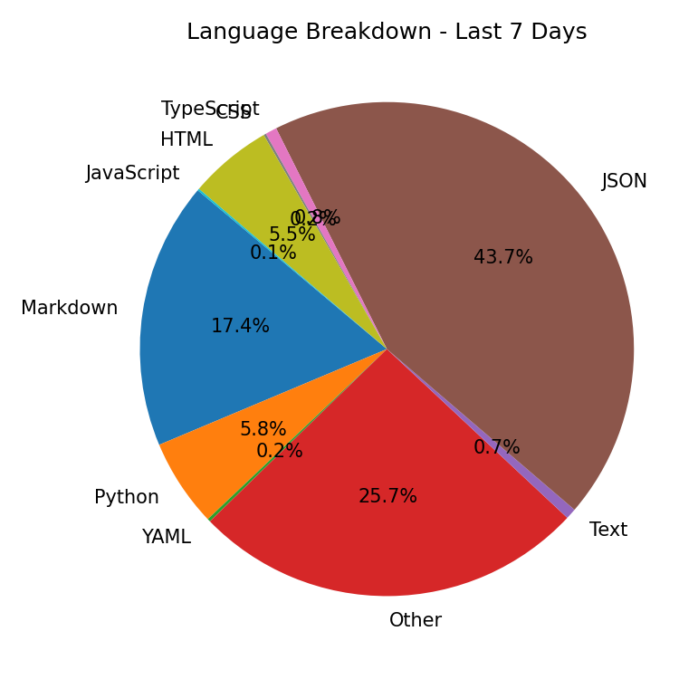
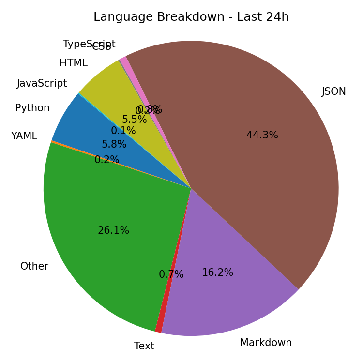
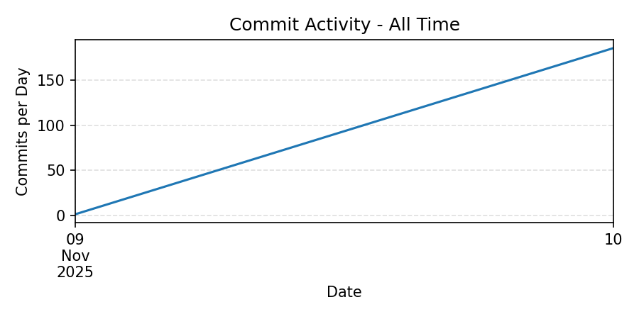
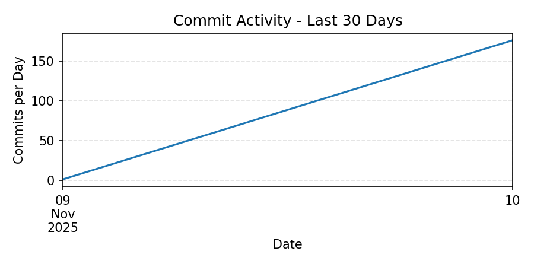
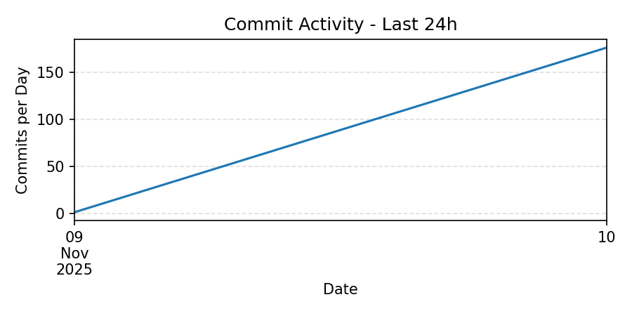

Absolutely! Here’s a fully fleshed-out **`README_TEMPLATE.md`** that showcases all the features of your analytics system, documents how to configure it, and is ready to publish on GitHub. It includes placeholder blocks, instructions, and the foldable JSON config section:

---

````markdown
# 📊 GitHub Repository Analytics

This repository contains a GitHub Action + Python scripts that automatically generate **repository analytics** and update your README with:

- Contributor statistics
- Commit activity trends
- Language breakdowns
- Repository pulse (total commits, lines added/deleted, contributors)
- Graphical visualizations using matplotlib

The analytics are **template-driven** and fully configurable via JSON embedded in the template.

---

## ⚡ Features

- **Template-Based:** Keep your README clean; analytics are injected from a template with placeholders.
- **Configurable:** Control timeframes, sections, graph sizes, and ignored file types using JSON.
- **Graphical Output:** Automatically generates charts for language breakdown and commit activity.
- **Multiple Timeframes:** Supports All Time, Last 30 Days, Last 7 Days, Last 24h, or custom timeframes.
- **Per-Section Control:** Select which analytics blocks are included in the output README.

---

## 📌 Usage

1. **Include the template placeholders** in your `README_TEMPLATE.md`:

```markdown
## 📊 Repository Analytics Overview

### All Time

| Contributor | Commits | +Add | -Del | Total | Top Languages |
|-------------|----------|------|------|--------|----------------|
| Celeste Weingartner | 172 | 40113 | 0 | 40113 | JSON (18070), Other (9990), Markdown (6617), Python (2380), HTML (2258), TypeScript (311), Text (289), YAML (83), CSS (65), JavaScript (50) |
| CryptoDragonLady | 1 | 661 | 0 | 661 | Other (661) |

### Last 30 Days

| Contributor | Commits | +Add | -Del | Total | Top Languages |
|-------------|----------|------|------|--------|----------------|
| Celeste Weingartner | 172 | 40113 | 0 | 40113 | JSON (18070), Other (9990), Markdown (6617), Python (2380), HTML (2258), TypeScript (311), Text (289), YAML (83), CSS (65), JavaScript (50) |
| CryptoDragonLady | 1 | 661 | 0 | 661 | Other (661) |

### Last 7 Days

| Contributor | Commits | +Add | -Del | Total | Top Languages |
|-------------|----------|------|------|--------|----------------|
| Celeste Weingartner | 172 | 40113 | 0 | 40113 | JSON (18070), Other (9990), Markdown (6617), Python (2380), HTML (2258), TypeScript (311), Text (289), YAML (83), CSS (65), JavaScript (50) |
| CryptoDragonLady | 1 | 661 | 0 | 661 | Other (661) |

### Last 24h

| Contributor | Commits | +Add | -Del | Total | Top Languages |
|-------------|----------|------|------|--------|----------------|
| Celeste Weingartner | 172 | 40113 | 0 | 40113 | JSON (18070), Other (9990), Markdown (6617), Python (2380), HTML (2258), TypeScript (311), Text (289), YAML (83), CSS (65), JavaScript (50) |
| CryptoDragonLady | 1 | 661 | 0 | 661 | Other (661) |


## 🧠 Language Breakdown

### All Time


### Last 30 Days


### Last 7 Days


### Last 24h



## 📈 Commit Activity Trends

### All Time


### Last 30 Days


### Last 7 Days


### Last 24h



## ⚡ Repository Pulse

- **Total Commits:** 173
- **Contributors:** 2
- **Lines Added:** 40774
- **Lines Deleted:** 0
- **First Commit Date:** 2025-11-09
- **Last Commit Date:** 2025-11-10


````

2. **Add the configuration block** at the bottom (hidden in `<details>`):

````markdown

````

3. **Run the analytics script**:

```bash
python scripts/generate_stats.py
```

4. **Output:**
   The script generates a fully updated `README.md` with all analytics blocks filled, charts saved in the `stats/` directory, and no leftover template markers.

---

## 📝 Example Sections

### Overview

## 📊 Repository Analytics Overview

### All Time

| Contributor | Commits | +Add | -Del | Total | Top Languages |
|-------------|----------|------|------|--------|----------------|
| Celeste Weingartner | 172 | 40113 | 0 | 40113 | JSON (18070), Other (9990), Markdown (6617), Python (2380), HTML (2258), TypeScript (311), Text (289), YAML (83), CSS (65), JavaScript (50) |
| CryptoDragonLady | 1 | 661 | 0 | 661 | Other (661) |

### Last 30 Days

| Contributor | Commits | +Add | -Del | Total | Top Languages |
|-------------|----------|------|------|--------|----------------|
| Celeste Weingartner | 172 | 40113 | 0 | 40113 | JSON (18070), Other (9990), Markdown (6617), Python (2380), HTML (2258), TypeScript (311), Text (289), YAML (83), CSS (65), JavaScript (50) |
| CryptoDragonLady | 1 | 661 | 0 | 661 | Other (661) |

### Last 7 Days

| Contributor | Commits | +Add | -Del | Total | Top Languages |
|-------------|----------|------|------|--------|----------------|
| Celeste Weingartner | 172 | 40113 | 0 | 40113 | JSON (18070), Other (9990), Markdown (6617), Python (2380), HTML (2258), TypeScript (311), Text (289), YAML (83), CSS (65), JavaScript (50) |
| CryptoDragonLady | 1 | 661 | 0 | 661 | Other (661) |

### Last 24h

| Contributor | Commits | +Add | -Del | Total | Top Languages |
|-------------|----------|------|------|--------|----------------|
| Celeste Weingartner | 172 | 40113 | 0 | 40113 | JSON (18070), Other (9990), Markdown (6617), Python (2380), HTML (2258), TypeScript (311), Text (289), YAML (83), CSS (65), JavaScript (50) |
| CryptoDragonLady | 1 | 661 | 0 | 661 | Other (661) |


### Language Breakdown

## 🧠 Language Breakdown

### All Time


### Last 30 Days


### Last 7 Days


### Last 24h


### Commit Activity Trends

## 📈 Commit Activity Trends

### All Time


### Last 30 Days


### Last 7 Days


### Last 24h


### Repository Pulse

## ⚡ Repository Pulse

- **Total Commits:** 173
- **Contributors:** 2
- **Lines Added:** 40774
- **Lines Deleted:** 0
- **First Commit Date:** 2025-11-09
- **Last Commit Date:** 2025-11-10


---

## 🛠 Configuration Options

* **timeframes:** Define custom labels and durations (in days) or `null` for all time.
* **languages.ignore:** File extensions to ignore in language analytics.
* **graphs:** Set chart width, height, and color.
* **sections.include:** Select which analytics blocks to render in the README.

> 💡 The JSON config is parsed directly from this template; you do **not** need to edit the script.

---

## 📈 Example Graphs

All generated charts are saved in the `stats/` folder and linked automatically in the README.

* **Language Breakdown:** Pie chart per timeframe
* **Commit Activity:** Line chart showing commits per day

---

## 🏃‍♂️ Automation

Combine this with a GitHub Action to regenerate the README nightly or on-demand:

```yaml
name: Repo Analytics

on:
  schedule:
    - cron: "0 3 * * *" # every night at 3AM UTC
  workflow_dispatch:

jobs:
  update-readme:
    runs-on: ubuntu-latest
    permissions:
      contents: write
    steps:
      - uses: actions/checkout@v4
      - name: Setup Python
        uses: actions/setup-python@v5
        with:
          python-version: "3.x"
      - name: Generate analytics
        run: python scripts/generate_stats.py
      - name: Commit and push updated README
        run: |
          git config user.name "github-actions[bot]"
          git config user.email "github-actions[bot]@users.noreply.github.com"
          git add README.md stats/
          git diff --quiet && echo "No changes to commit." || (git commit -m "Update README analytics" && git push)
```

If you want it to regenerate it on commit and or manual execution  use this example instead: 

```yaml
name: Repo Analytics

on:
  push:
    branches:
      - main
  workflow_dispatch:

jobs:
  update-readme:
    runs-on: ubuntu-latest
    permissions:
      contents: write
    steps:
      - uses: actions/checkout@v4
      - name: Setup Python
        uses: actions/setup-python@v5
        with:
          python-version: "3.x"
      - name: Generate analytics
        run: python scripts/generate_stats.py
      - name: Commit and push updated README
        run: |
          git config user.name "github-actions[bot]"
          git config user.email "github-actions[bot]@users.noreply.github.com"
          git add README.md stats/
          git diff --quiet && echo "No changes to commit." || (git commit -m "Update README analytics" && git push)
```


---

## ✅ Summary

This template allows you to:

* Keep your README clean and professional
* Dynamically show contributors, commits, languages, and activity
* Generate charts automatically
* Fully customize sections and timeframes without touching the code

> Publish this repo to GitHub, enable the action, and watch your README update automatically!

```

---

This template:  

- **Documents usage** for new users  
- Shows **all blocks and charts**  
- Explains **configuration and automation**  
- Includes **foldable JSON config**  

---

```
