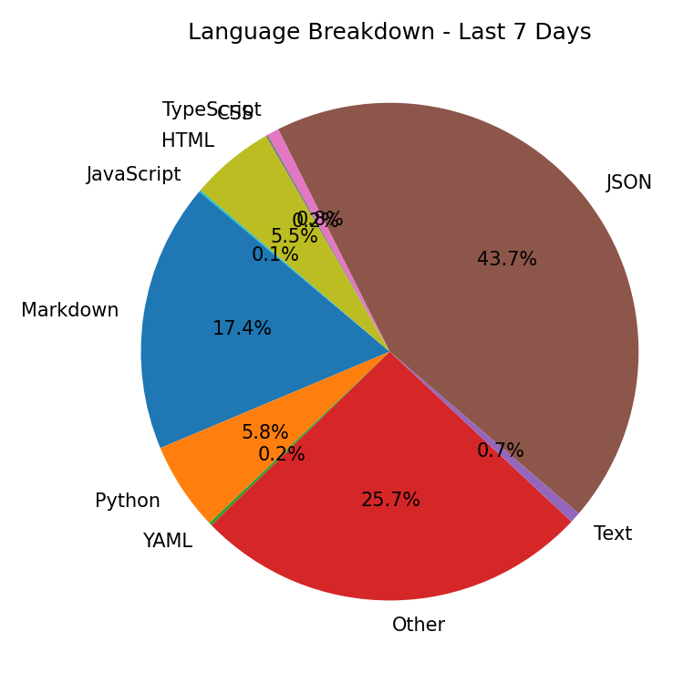
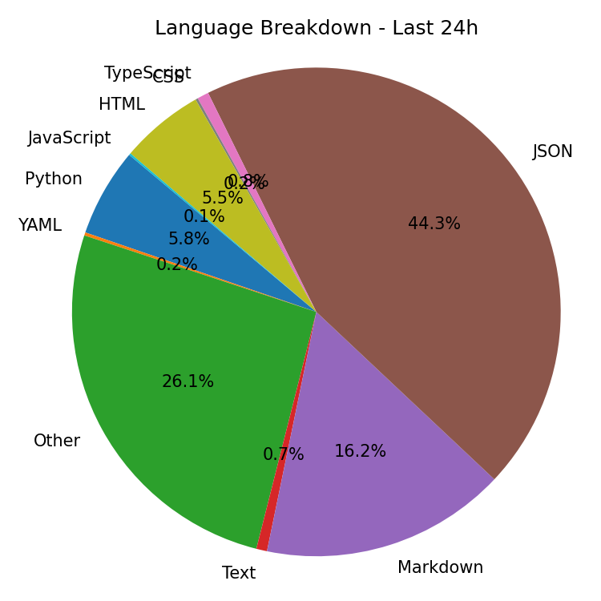
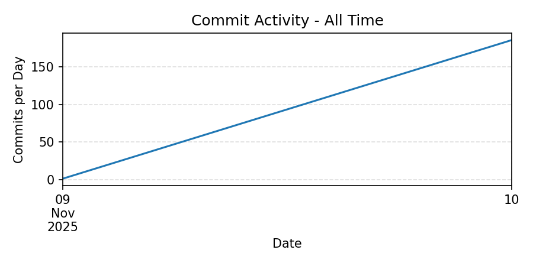
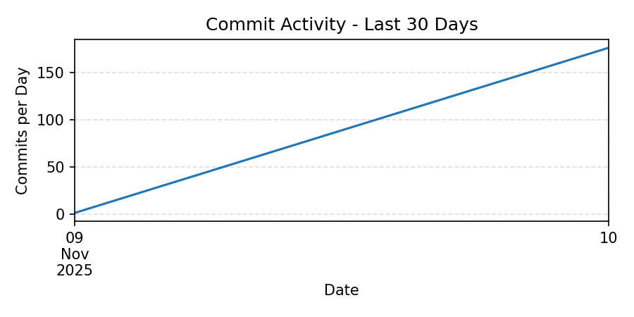
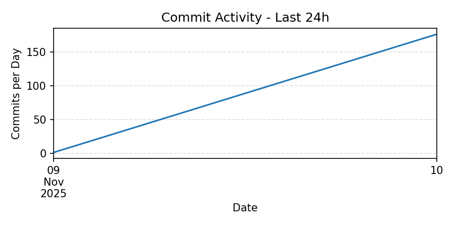

# Please, if you like this and you want to contribute, fork it and make a pull request. 
I'd love you see your additions. -C
---

# 📊 GitHub Repository Analytics

This repository contains a GitHub Action + Python scripts that automatically generate **repository analytics** and update your README with:

- Contributor statistics
- Commit activity trends
- Language breakdowns
- Repository pulse (total commits, lines added/deleted, contributors)
- Changelog generated from recent git history
- Graphical visualizations using matplotlib

The analytics are **template-driven** and fully configurable via JSON embedded in the template.

---

## ⚡ Features

- **Template-Based:** Keep your README clean; analytics are injected from a template with placeholders.
- **Configurable:** Control timeframes, sections, graph sizes, and ignored file types using JSON.
- **Graphical Output:** Automatically generates charts for language breakdown and commit activity.
- **Multiple Timeframes:** Supports All Time, Last 30 Days, Last 7 Days, Last 24h, or custom timeframes.
- **Per-Section Control:** Select which analytics blocks are included in the output README.

---

## 📌 Usage

1. **Include the template placeholders** in your `README_TEMPLATE.md`:

< !-- STATS BREAKDOWN START:OVERVIEW -->
< !-- Placeholder for overview analytics -->
< !-- STATS BREAKDOWN END:OVERVIEW -->

< !-- STATS BREAKDOWN START:LANGUAGE -->
< !-- Placeholder for language analytics -->
< !-- STATS BREAKDOWN END:LANGUAGE -->

< !-- STATS BREAKDOWN START:COMMITS -->
< !-- Placeholder for commit activity analytics -->
< !-- STATS BREAKDOWN END:COMMITS -->

< !-- STATS BREAKDOWN START:PULSE -->
< !-- Placeholder for repository pulse -->
< !-- STATS BREAKDOWN END:PULSE -->


(extra space added betweeb < and ! so that the blocks dont get replaced and the example will show)

2. **Add the configuration block** at the bottom (hidden in `<details>`):
```markdown
<details>
<summary>📈 Analytics Config</summary>

{
  "timeframes": {
    "All Time": null,
    "Last 90 Days": "90d",
    "Last 30 Days": "30d",
    "Last 24 Hours": "24h"
  },
  "graphs": {
    "show": true,
    "width": 720,
    "height": 320,
    "color": "#4e79a7"
  },
  "languages": {
    "show_breakdown": true,
    "ignore": ["lock", "json"]
  },
  "contributors": {
    "show": true,
    "max": 10
  },
  "changelog": {
    "show": true,
    "max_entries": 80,
    "max_days": 45,
    "max_per_day": 8,
    "include_authors": true
  },
  "sections": {
    "include": ["PULSE", "OVERVIEW", "COMMITS", "LANGUAGE", "CHANGELOG"]
  }
}

</details>
```

3. **Run the analytics script**:

```bash
python .github/scripts/generate_stats_enhanced.py
```

4. **Output:**
   The script generates a fully updated `README.md` with all analytics blocks filled, charts saved in the `stats/` directory, and no leftover template markers.

---

## 📝 Example Sections

### Overview

## 📊 Repository Analytics Overview

### All Time

| Contributor | Commits | +Add | -Del | Total | Top Languages |
|-------------|----------|------|------|--------|----------------|
| Celeste Weingartner | 179 | 40143 | 33 | 40176 | JSON (18070), Other (9990), Markdown (6666), Python (2394), HTML (2258), TypeScript (311), Text (289), YAML (83), CSS (65), JavaScript (50) |
| github-actions[bot] | 7 | 492 | 165 | 657 | Markdown (657) |
| CryptoDragonLady | 1 | 661 | 0 | 661 | Other (661) |

### Last 30 Days

| Contributor | Commits | +Add | -Del | Total | Top Languages |
|-------------|----------|------|------|--------|----------------|
| Celeste Weingartner | 179 | 40143 | 33 | 40176 | JSON (18070), Other (9990), Markdown (6666), Python (2394), HTML (2258), TypeScript (311), Text (289), YAML (83), CSS (65), JavaScript (50) |
| github-actions[bot] | 7 | 492 | 165 | 657 | Markdown (657) |
| CryptoDragonLady | 1 | 661 | 0 | 661 | Other (661) |

### Last 7 Days

| Contributor | Commits | +Add | -Del | Total | Top Languages |
|-------------|----------|------|------|--------|----------------|
| Celeste Weingartner | 179 | 40143 | 33 | 40176 | JSON (18070), Other (9990), Markdown (6666), Python (2394), HTML (2258), TypeScript (311), Text (289), YAML (83), CSS (65), JavaScript (50) |
| github-actions[bot] | 7 | 492 | 165 | 657 | Markdown (657) |
| CryptoDragonLady | 1 | 661 | 0 | 661 | Other (661) |

### Last 24h

| Contributor | Commits | +Add | -Del | Total | Top Languages |
|-------------|----------|------|------|--------|----------------|
| Celeste Weingartner | 179 | 40143 | 33 | 40176 | JSON (18070), Other (9990), Markdown (6666), Python (2394), HTML (2258), TypeScript (311), Text (289), YAML (83), CSS (65), JavaScript (50) |
| github-actions[bot] | 7 | 492 | 165 | 657 | Markdown (657) |
| CryptoDragonLady | 1 | 661 | 0 | 661 | Other (661) |


### Language Breakdown

## 🧠 Language Breakdown

### All Time


### Last 30 Days


### Last 7 Days


### Last 24h



### Commit Activity Trends

## 📈 Commit Activity Trends

### All Time


### Last 30 Days


### Last 7 Days


### Last 24h



### Repository Pulse

## ⚡ Repository Pulse

- **Total Commits:** 187
- **Contributors:** 3
- **Lines Added:** 41296
- **Lines Deleted:** 198
- **First Commit Date:** 2025-11-09
- **Last Commit Date:** 2025-11-10


---

## 🛠 Configuration Options

* **timeframes:** Define custom labels and durations (in days) or `null` for all time.
* **languages.ignore:** File extensions to ignore in language analytics.
* **graphs:** Set chart width, height, and color.
* **sections.include:** Select which analytics blocks to render in the README.

> 💡 The JSON config is parsed directly from this template; you do **not** need to edit the script.

---

## 📈 Example Graphs

All generated charts are saved in the `stats/` folder and linked automatically in the README.

* **Language Breakdown:** Pie chart per timeframe
* **Commit Activity:** Line chart showing commits per day

---

## 🏃‍♂️ Automation

Combine this with a GitHub Action to regenerate the README nightly or on-demand:

```yaml
name: Repo Analytics

on:
  schedule:
    - cron: "0 3 * * *" # every night at 3AM UTC
  workflow_dispatch:

jobs:
  update-readme:
    runs-on: ubuntu-latest
    permissions:
      contents: write
    steps:
      - uses: actions/checkout@v4
      - name: Setup Python
        uses: actions/setup-python@v5
        with:
          python-version: "3.x"
      - name: Generate analytics
        run: python .github/scripts/generate_stats_enhanced.py
      - name: Commit and push updated README
        run: |
          git config user.name "github-actions[bot]"
          git config user.email "github-actions[bot]@users.noreply.github.com"
          git add README.md stats/
          git diff --quiet && echo "No changes to commit." || (git commit -m "Update README analytics" && git push)
```

If you want it to regenerate it on commit and or manual execution  use this example instead: 

```yaml
name: Repo Analytics

on:
  push:
    branches:
      - main
  workflow_dispatch:

jobs:
  update-readme:
    runs-on: ubuntu-latest
    permissions:
      contents: write
    steps:
      - uses: actions/checkout@v4
      - name: Setup Python
        uses: actions/setup-python@v5
        with:
          python-version: "3.x"
      - name: Generate analytics
        run: python .github/scripts/generate_stats_enhanced.py
      - name: Commit and push updated README
        run: |
          git config user.name "github-actions[bot]"
          git config user.email "github-actions[bot]@users.noreply.github.com"
          git add README.md stats/
          git diff --quiet && echo "No changes to commit." || (git commit -m "Update README analytics" && git push)
```


---

## ✅ Summary

This template allows you to:

* Keep your README clean and professional
* Dynamically show contributors, commits, languages, and activity
* Generate charts automatically
* Fully customize sections and timeframes without touching the code

> Publish this repo to GitHub, enable the action, and watch your README update automatically!

```

---

This template:  

- **Documents usage** for new users  
- Shows **all blocks and charts**  
- Explains **configuration and automation**  
- Includes **foldable JSON config**  

---

```


## Live Auto-Updated Blocks

These sections are refreshed by `python .github/scripts/generate_stats_enhanced.py` and retain markers for subsequent updates.

### Repository Pulse
<!-- STATS BREAKDOWN START:PULSE -->

## Repository Pulse

| Metric | Value |
|--------|-------|
| Commits (All Time) | 18 |
| Contributors (All Time) | 3 |
| Lines Added (All Time) | 41307 |
| Lines Deleted (All Time) | 211 |
| Churn (All Time) | 41518 |
| Files Changed (All Time) | 175 |
| First Commit Date | 2025-11-29 |
| Last Commit Date | 2025-11-29 |

_Generated: 2026-02-22 00:05 UTC_

<!-- STATS BREAKDOWN END:PULSE -->

### Repository Overview
<!-- STATS BREAKDOWN START:OVERVIEW -->

## Repository Analytics Overview

| Window | Commits | Contributors | +Add | -Del | Churn | Files | Avg Churn/Commit |
|--------|---------|--------------|------|------|-------|-------|------------------|
| All Time | 18 | 3 | 41307 | 211 | 41518 | 175 | 2306.6 |
| Last 90 Days | 1 | 1 | 0 | 0 | 0 | 1 | 0.0 |
| Last 30 Days | 0 | 0 | 0 | 0 | 0 | 0 | 0.0 |
| Last 24 Hours | 0 | 0 | 0 | 0 | 0 | 0 | 0.0 |

### Top Contributors (Last 90 Days)

| Contributor | Commits | Churn | Share of Churn |
|-------------|---------|-------|----------------|
| Celeste Weingartner | 1 | 0 | 0.0% |

### Most Changed Files (Last 90 Days)

| File | Churn |
|------|-------|
| `.github/workflows/main.yml => action.yml` | 0 |

<!-- STATS BREAKDOWN END:OVERVIEW -->

### Commit Trends
<!-- STATS BREAKDOWN START:COMMITS -->

## Commit Activity Trends

### All Time
- Commits: **18** | Active days: **3** | Peak day: **2025-11-10 (16)**
- Additions: **41307** | Deletions: **211** | Churn: **41518**
_No commit activity in this window._

### Last 90 Days
- Commits: **1** | Active days: **1** | Peak day: **2025-11-29 (1)**
- Additions: **0** | Deletions: **0** | Churn: **0**
_No commit activity in this window._

### Last 30 Days
- Commits: **0** | Active days: **0** | Peak day: **n/a**
- Additions: **0** | Deletions: **0** | Churn: **0**
_No commit activity in this window._

### Last 24 Hours
- Commits: **0** | Active days: **0** | Peak day: **n/a**
- Additions: **0** | Deletions: **0** | Churn: **0**
_No commit activity in this window._

<!-- STATS BREAKDOWN END:COMMITS -->

### Language Breakdown
<!-- STATS BREAKDOWN START:LANGUAGE -->

## Language Breakdown

### All Time
| Language | Churn | Share |
|----------|-------|-------|
| Markdown | 7347 | 50.8% |
| Python | 2394 | 16.6% |
| HTML | 2258 | 15.6% |
| SVG | 764 | 5.3% |
| Other | 720 | 5.0% |
| TypeScript | 311 | 2.2% |
| TXT | 289 | 2.0% |
| MDX | 176 | 1.2% |

### Last 90 Days
_No language churn data in this window._

### Last 30 Days
_No language churn data in this window._

### Last 24 Hours
_No language churn data in this window._

<!-- STATS BREAKDOWN END:LANGUAGE -->

### Recent Updates
<!-- STATS BREAKDOWN START:CHANGELOG -->

_No commits found in the configured changelog window._

_Generated: 2026-02-22 00:05 UTC_

<!-- STATS BREAKDOWN END:CHANGELOG -->


<details>
<summary>📈 Analytics Config</summary>

```json
{
  "timeframes": {
    "All Time": null,
    "Last 90 Days": "90d",
    "Last 30 Days": "30d",
    "Last 24 Hours": "24h"
  },
  "graphs": {
    "show": true,
    "width": 720,
    "height": 320,
    "color": "#4e79a7"
  },
  "languages": {
    "show_breakdown": true,
    "ignore": ["lock", "json"]
  },
  "contributors": {
    "show": true,
    "max": 10
  },
  "changelog": {
    "show": true,
    "max_entries": 80,
    "max_days": 45,
    "max_per_day": 8,
    "include_authors": true
  },
  "sections": {
    "include": ["PULSE", "OVERVIEW", "COMMITS", "LANGUAGE", "CHANGELOG"]
  }
}
```

</details>
